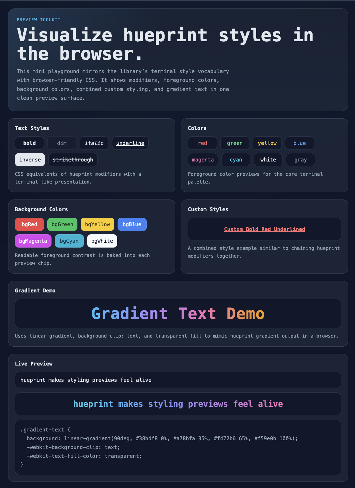

<p align="center">
  
</p>

<h1 align="center">hueprint</h1>

<p align="center">
  Next-gen terminal styling & developer logging toolkit for Node.js
</p>

<p align="center">
  
  
  
</p>

<p align="center">
  ANSI colors, gradients, theming, and developer-friendly console logging for modern JavaScript and TypeScript projects.
</p>

`hueprint` is a modern terminal styling and logging toolkit for Node.js, designed to create expressive console output, structured logs, and visually rich CLI experiences using ANSI colors, gradients, and themes.

It combines a chainable styling API, a functional styling API, gradient text, reusable themes, and built-in logging helpers in a lightweight package built for developer tools, CLIs, scripts, and Node.js applications.

## ✨ Preview

<p align="center">
  
</p>

## Features

- ANSI color styling with manual escape code handling
- Chainable API for expressive styling
- Functional API for object-based styling
- Gradient text support for richer CLI presentation
- Built-in logging helpers for success, error, warn, and info
- Theme system for reusable output patterns
- Zero runtime dependencies in the core package
- High performance and tree-shakable exports
- ESM and CommonJS support for modern Node.js projects

## Installation

```bash
npm install hueprint
```

## 🚀 Usage

```js
import hueprint from 'hueprint';

console.log(hueprint.red('Hello World'));
hueprint.log.success('Server started');
hueprint.log.error('Something failed');

console.log(
  hueprint.gradient('Loading...', {
    colors: ['#ef4444', '#f59e0b'],
  }),
);
```

## Quick Start

```ts
import hueprint, { createHueprint, createTheme } from 'hueprint';

console.log(hueprint.red.bold('Hello World'));

console.log(
  hueprint.style('Configurable', {
    color: 'cyan',
    backgroundColor: 'bgBlack',
    underline: true,
  }),
);

console.log(
  hueprint.gradient('Gradient', {
    colors: ['#ef4444', '#f59e0b', '#10b981'],
  }),
);

const theme = createTheme({
  primary: { color: 'blue', bold: true },
  success: { color: 'green', bold: true, prefix: '[ok] ' },
});

const hp = createHueprint({ theme });

console.log(hp.theme('success', 'Deployed'));
console.log(hp.format('info', 'Server listening on port 3000'));
hp.log.success('Saved settings');
```

## API Highlights

### Chainable styling

```ts
hueprint.red.bold('Hello World');
hueprint.bgBlue.white.underline('Readable contrast');
```

### Functional styling

```ts
hueprint.style('Configurable text', {
  color: 'magenta',
  bold: true,
  italic: true,
});
```

### Logging helpers

```ts
hueprint.format('success', 'Build completed');
hueprint.log.error('Could not connect');

const log = createHueprint({
  logger: {
    info: {
      prefix: 'i',
      label: 'NOTICE',
      style: { color: 'cyan', bold: true },
    },
  },
});

log.log.info('Custom badge');
```

### Themes

```ts
const theme = createTheme({
  primary: { color: 'cyan', bold: true },
  danger: { color: 'red', bold: true, prefix: '!! ' },
});

const hp = createHueprint({ theme });

hp.theme('primary', 'Reusable style');
hp.theme('danger', 'Something failed');
```

### Tree-shakable modules

```ts
import { applyGradient } from 'hueprint/gradient';
import { createTheme } from 'hueprint/theme';
import { normalizeStyleOptions } from 'hueprint/core';
```

## Why Use hueprint?

`hueprint` is built for developers who want expressive terminal output and structured logging in one cohesive toolkit. It combines styling, theming, and logging utilities into a unified API designed for modern CLI applications, Node.js tooling, and developer workflows.

## Best Node.js Console Styling Library

`hueprint` provides a complete solution for terminal styling and logging in Node.js applications. With a clean API, strong TypeScript support, and flexible styling options, it enables developers to build polished CLI experiences with minimal effort.

## Terminal Color Libraries for JavaScript

`hueprint` offers ANSI color styling, gradient text rendering, and reusable themes in a single lightweight package. It is designed for JavaScript and TypeScript projects that need clear, expressive, and maintainable console output.

## 🌐 Playground

The browser playground provides a visual preview of hueprint-inspired colors, modifiers, custom styles, and gradient text. GitHub README rendering does not fully support raw browser-style HTML previews, so the interactive demo should be opened locally.

```bash
cd playground
open index.html
```

Future GitHub Pages support can be linked here once the playground is deployed.

## Development

```bash
npm install
npm run build
npm run test
npm run typecheck
```
